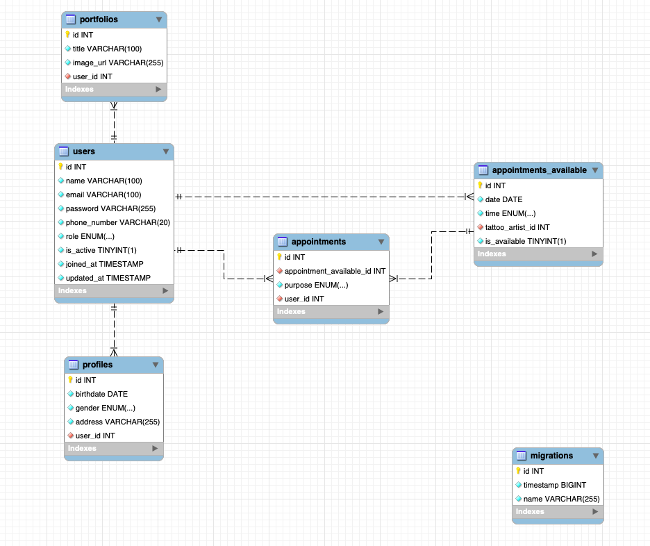

# Proyecto de Backend
## Tattoo Studio

 Este es el backend del sistema de gestion de citas de un estudio de tatuaje. Este proyecto se realizó como parte del Bootcamp Full Stack Developer de Geekshubs Academy.

## Tecnologias Utilizadas

## Tabla de Contenidos
- 🧾[Diseño BBDD](#diseño-bbdd)
- ⚙️[Instalacion en local](#einstalacion-en-local)
- 🎯[Endpoints](#endpoints)
- 🛠️[Posibles Mejoras](#posibles-mejoras)
- 💻[Contacto](#contacto)

## Diseño BBDD

## Instalacion en local
1. Clonar el repositorio
2. ` $ npm install `
3. Conectamos nuestro repositorio con la base de datos 
4. ` $ Ejecutamos las migraciones `
5. ` $ npm run dev `

## Endpoints

 Endpoints 

- REGISTER

            POST http://localhost:6000/user/register
        body:
            {
                "name":"vanessa",
                "email":"vanessa@gmail.com",
                "password": "Vanessa9",
                "phone_number":"695185577"
            }
        
- LOGIN

            POST http://localhost:6000/user/login 
        body:
            {
                "email":"vanessa@gmail.com",
                "password":"Vanessa9"
            }

- UPDATE USER

            PUT http://localhost:6000/user/update 
        body:
            {
                "name":"Vanessa",
                "phone_number":"0034695184499"
            }

- CREATE PROFILE

            POST http://localhost:6000/user/profile 
        body:
            {
                "birthdate":"1995-01-09",
                "gender":"female",
                "address":"puerto la cruz"
            }

- UPDATE PROFILE

            PUT http://localhost:6000/user/profile 
        body:
            {
                "gender":"female",
                "address":"polo y peyrolon",
                "id":1
            }

- TAKE APPOINTMENT

            POST http://localhost:6000/user/newAppointment 
        body:
            {
                "appointment_available_id":6,
                "purpose":"tattoo"
            }

- CANCEL APPOINTMENT

            DELETE http://localhost:6000/user/cancelAppointment
        body:
            {
               "id":4
            }

- GET ALL APPOINTMENTS AS USER

            GET http://localhost:6000/user/myAppointments

- GET ALL APPOINTMENTS AVAILABLE

            GET http://localhost:6000/appointment_available/all

- CREATE APPOINTMENT AVAILABLE

            POST http://localhost:6000/appointment_available/new
        body:
            {
              "date":"2023-11-01",
              "time":"10:00",
              "tattoo_artist_id":4
            }

- UPDATE APPOINTMENT AVAILABLE

            PUT http://localhost:6000/appointment_available/update
        body:
            {
              "id":2,
              "date":"2023-09-24",
              "time":"10:00",
              "tattoo_artist_id":1,
              "is_available":false
            }

- DELETE APPOINTMENT AVAILABLE

            DELETE http://localhost:6000/appointment_available/delete
        body:
            {
              "id":7
            }

- GET ALL APPOINTMENT AVAILABLE AS TATTOO ARTIST

            GET http://llocalhost:6000/user/tattooArtist/appointments

- GET ALL APPOINTMENT TAKEN WITH TATTOO ARTIST(AS TATTO ARTIST)

            GET http://localhost:6000/user/tattooArtist/appointmentsTaken

- POST NEW PROJECT AS TATTOO ARTIST

            POST http://localhost:6000/user/tattooArtist/portfolio/new
        body:
            {
              "title":"My first tattoo",
              "image_url":"https://resizer.sevilla.abc.es/resizer/resizer.php?imagen=https://sevilla.abc.es/estilo/bulevarsur/wp-content/uploads/sites/14/2021/02/mini-tatuaje-twotattoo-p.jpg&nuevoancho=652"
            }

- DELETE PROJECT AS TATTOO ARTIST

            DELETE http://localhost:6000/user/tattooArtist/portfolio/delete
        body:
            {
              "id":1
            }

- MODIFY ROLE AS SUPER_ADMIN

            PUT http://localhost:6000/user/superAdmin/createNewTattooArtist
        body:
            {
              "id":5,
              "role":"tatto_artist"
            }

- DELETE USER AS SUPER_ADMIN

            DELETE http://localhost:6000/user/superAdmin/deleteUser
        body:
            {
              "id":1
            }

## Contacto

